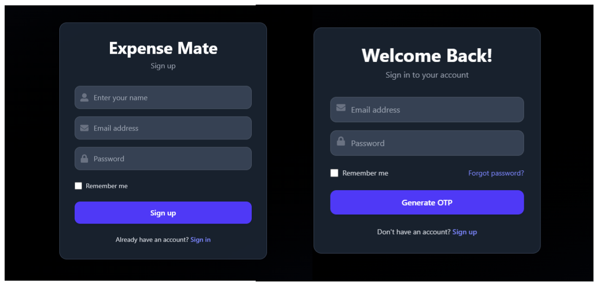
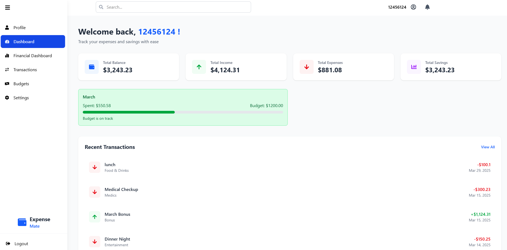
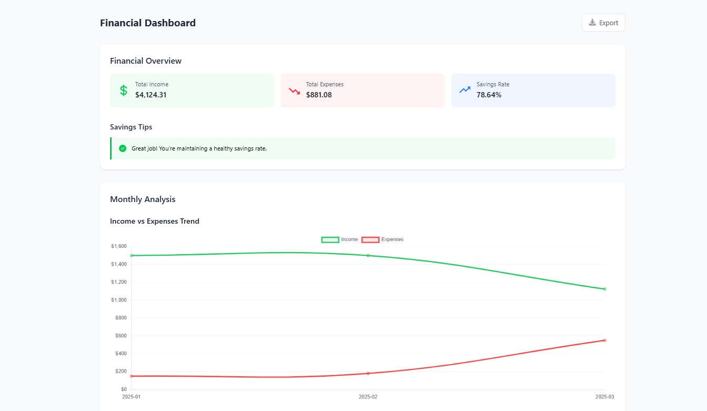
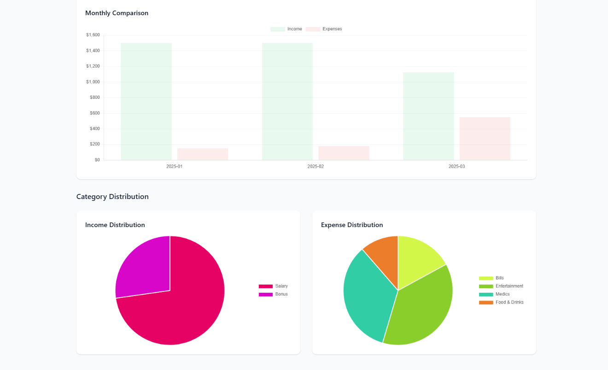
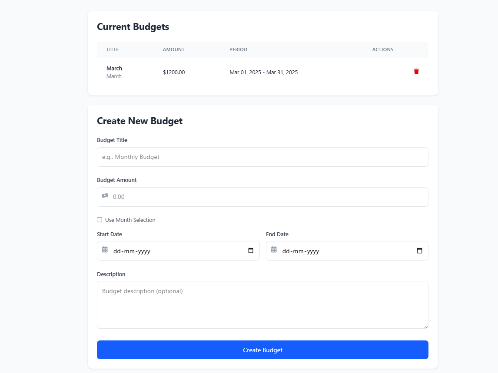
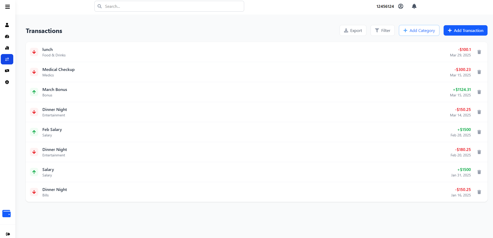
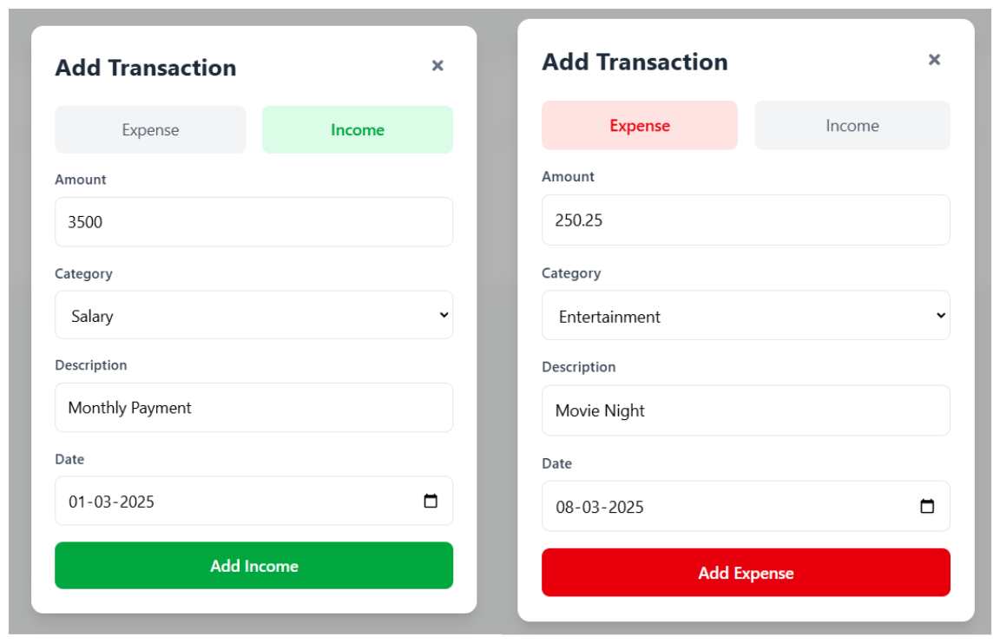
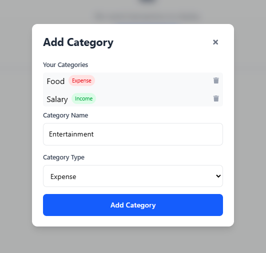

#  ExpenseMate - An Expense Tracker

A full-stack web application for tracking personal and organizational expenses with separate user and admin interfaces.

## Features

- 🔐 User Authentication & Authorization
- 📊 Dashboard with Expense Analytics
- 💰 Transaction Management
- 📅 Budget Planning
- 👥 User Management (Admin)
- 📈 Financial Reports
- 🔍 Search & Filter Capabilities

## Screenshots
### User Interface

### Login & Authentication

### Dashboard & Analytics

### Budget Planning

### Transactions Page

### Add Category 

## Tech Stack

### Frontend
- React.js
- Tailwind CSS
- Axios for API calls
- React Router for navigation
- React Hook Form for form handling

### Backend
- FastAPI (Python)
- MongoDB
- Async operations

### For More Details Checkout Presentation and Report